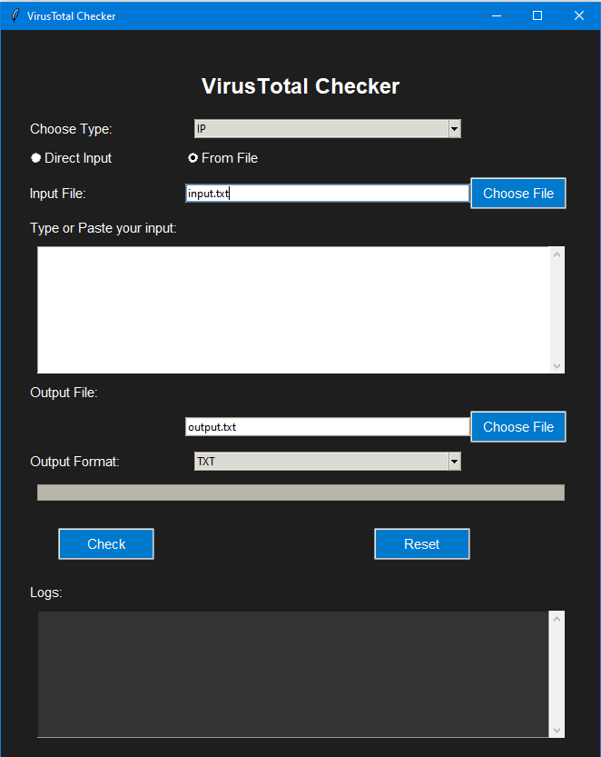

# VirusTotal_Checker (1.0)
A simple Virus Total Check for batch processing for my DFIR work

You can use either GUI or CLI

### Screenshot
  

## Installation
Make sure to replace `"YOUR_VT_API_KEY"` in the `vt_utils.py` file with a valid **VirusTotal API** key. Also, install required dependencies such as `requests` and `tkinter`:

VT-Checker built using python3 so in order to use the tool you need to install the required libraries.

`python3 -m pip install -r requirements.txt`

or

```
pip install requests
pip install tkinter
pip install argparse
```


## GUI - VTCGUI.py
You just need to provide input type and input file or just copy and paste the input

```
python VTCGUI.py
```

This command will launch the GUI for the VirusTotal checker.


Input types:

- IP
- MD5
- SHA1
- SHA256

Output:
- CSV
- JSON
- TXT
  
## CLI - VTCLI.py

### Usage

`VTCLI.py [-h] -t {IP,URL,MD5 Hash,SHA1 Hash,SHA256 Hash} [-d DATA] [-f FILE] -o OUTPUT [-fmt {CSV,JSON,TXT}]`

Example

```
python VTCLI.py -t IP -d 8.8.8.8,8.8.4.4 -o output.csv -fmt CSV
```


### Options
```
-t    Specify the type of data you want to check. It can be an IP address, URL, or a type of hash (MD5, SHA1, SHA256).
-d    Provide the data directly as a comma-separated list. For example, '8.8.8.8,8.8.4.4'. Either this or --file must be provided.
-f    Path to an input file containing the data to be checked. Data should be listed line by line. Either this or --data must be provided.
-o    Specify the path where you'd like the output file to be saved. For example, 'output.csv'.
-fmt  Specify the format for the output file. The default is CSV, but JSON and TXT are also available.
```
